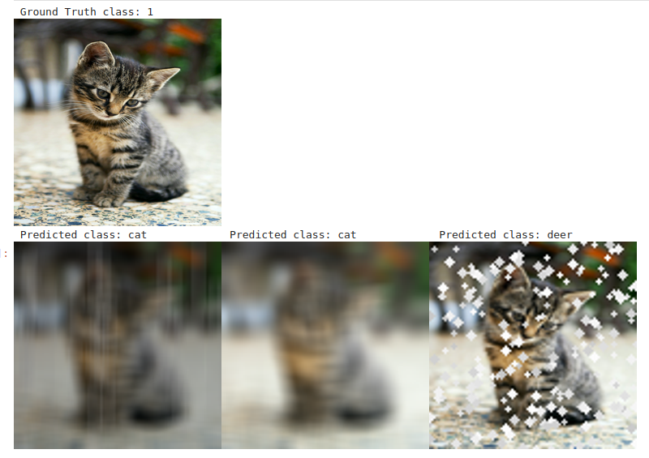

## Project Overview

This project focuses on training multiple deep learning models of the same architecture on shifted domain datasets and then developing a unified model which performs reasonably well on all the shifted domains without any training. The key components of this repository include:

- **Data Management**: Loading, preprocessing, and augmenting images from datasets such as the STL-10 dataset.
- **Model Training**: Training a ResNet model on these augmented datasets and evaluating its performance.
- **Data Augmentation**: Applying domain-specific augmentations such as adding rain, fog, and autumn effects to images.
- **Training Process**: The training process leverages PyTorch, along with advanced features like learning rate scheduling and integration with Weights and Biases (wandb) for experiment tracking.

### Directory Structure

```
.
├── app.py                     # Streamlit interface to visualise the results
├── aug                         # Data augmentation scripts
│   ├── automold_helper.py      # Helper functions for augmentations
│   ├── automold.py             # Contains functions to apply augmentations (rain, fog, autumn)
│   ├── data_manager.py         # Handles data loading and preprocessing
├── demo.ipynb                  # Jupyter notebook for demonstration
├── exp.ipynb                   # Jupyter notebook for experimental results -> includes the various approaches tried
├── fig.png                     # Image used in the notebook for visualizations -> Augmentation effect on images
├── Grad.ipynb                  # Jupyter notebook, experimenting with Grad-CAM
├── hack.py                     # Helper script with data augmentation and preprocessing
├── models.py                   # Defines the ResNet architecture and model loading logic
├── tinkering.ipynb             # Jupyter notebook for experimentation (version 1, old)
├── trainer.py                  # Trainer class that handles model training and evaluation
├── training.ipynb              # Jupyter notebook for model training
├── train.py                    # Script for training the model
└── utils.py                    # Utility functions for the project
```

## Setup and Installation

1. Clone the repository:

   ```bash
   git clone <repo_url>
   cd <repo_name>
   ```

2. Install dependencies:

   Ensure you have Python 3.7+ and `pip` installed. Then, install the required libraries by running:

   ```bash
   pip install -r requirements.txt
   ```

   The requirements include libraries such as:

   - `torch` (for PyTorch)
   - `torchvision` (for image transformations)
   - `wandb` (for experiment tracking)
   - `PIL`, `numpy`, `cv2` (for image handling and transformations)

3. Prepare the data:

   The project assumes that the STL-10 dataset (in binary format) is stored in the `./stl10_binary/` directory. Download the dataset from [here](https://cs.stanford.edu/~acoates/stl10/) and place it in the appropriate directory.

## Key Modules

### `hack.py`
This script provides functions for loading and augmenting images using techniques such as adding rain, fog, or autumn effects. It utilizes the `DataManager` class for loading the STL-10 dataset and applies transformations to images.

### `trainer.py`
The `Trainer` class is responsible for training and evaluating the deep learning model. It handles:

- Training loop: Logs training losses, optimizes the model using Adam optimizer, and applies learning rate adjustments.
- Evaluation: Evaluates the model on test data and logs metrics such as test loss and accuracy.

### `models.py`
This file contains the definition of the `ResNet` architecture and a method for loading pre-trained models. It supports various versions of ResNet (e.g., ResNet-101) and is designed to work with the custom dataset.

### `aug/automold.py`
This module contains functions that apply data augmentation techniques to images, such as adding:

- **Rain**: Simulates rainy weather conditions on images.
- **Fog**: Adds a fog effect to images.
- **Autumn**: Alters the image to simulate autumn foliage.

These augmentations are applied to training data to improve the generalization of the model.

### `utils.py`
Utility functions for various helper tasks, such as image transformations, resizing, or other preprocessing functions.

## Training the Model

To train the model, use the `train.py` script. Here's an example of how to run it:

```bash
python train.py
```

This will start the training process using the default parameters in the script. You can modify parameters such as the number of epochs, batch size, learning rate, and augmentation domain (base, rain, autumn, fog) directly in the script.

Alternatively, you can also use the `trainer.py` class for more fine-grained control over the training process:

```python
from models import ResNet
from trainer import Trainer
from aug.automold import add_rain, add_fog, add_autumn

# Initialize data manager and model
data_manager = DataManager(root_dir="./data")
model = ResNet.load_model("resnet101", n_classes=10, in_channels=3)

# Initialize and run the trainer
trainer = Trainer(
    model,
    data_manager,
    epochs=200,
    batch_size=256,
    eval_interval=200,
    device="cuda:0",
    learning_rate=0.001,
)

trainer.train(domain="base", run_name="stl10")
```

## Benchmarks

### Domain-Specific Models
| Domain  | Base  | Rain  | Fog   | Autumn |
|---------|-------|-------|-------|--------|
| Base    | 63.32 | 29.04 | 54.14 | 26.77  |
| Rainy   | 26.02 | 60.26 | 32.36 | 26.38  |
| Foggy   | 51.55 | 39.90 | 62.92 | 24.14  |
| Autumn  | 16.25 | 11.98 | 17.26 | 39.16  |
| **All** | 29.28 | 30.48 | 31.50 | 40.20  |

---

### Method 1: MTL (Task Vector Averaging)

### Editing Models with Task Arithmetic
*Reference: [Task Arithmetic - Arxiv 2212.04089](https://arxiv.org/pdf/2212.04089)*

| Alpha   | Base  | Rain  | Fog   | Autumn |
|---------|-------|-------|-------|--------|
| 0       | 63.38 | 26.68 | 51.42 | 16.52  |
| 1e-4    | 38.80 | 16.24 | 25.82 | 14.14  |
| 1e-3    | 19.34 | 13.04 | 16.56 | 11.59  |
| 1e-2    | 12.52 | 10.74 | 13.00 | 11.66  |
| 1e-1    | 10.00 | 10.00 | 10.00 | 11.92  |
| 1e0     | 10.00 | 10.00 | 10.00 | 10.00  |
| 1e1     | 10.00 | 10.00 | 10.00 | 10.00  |
| 1e2     | 10.00 | 10.00 | 10.00 | 10.00  |
| 1e3     | 10.00 | 10.00 | 10.00 | 10.00  |

---

### Method 2: SLERP (Spherical Linear Interpolation)

### SLERP Rain → Fog
| t       | Base    | Rain    | Fog     | Autumn  |
|---------|---------|---------|---------|---------|
| 0.0     | 0.6529  | 0.8296  | 0.6965  | 0.1120  |
| 0.1     | 0.5886  | 0.5303  | 0.5085  | 0.1145  |
| 0.2     | 0.5091  | 0.3613  | 0.3845  | 0.1093  |
| 0.3     | 0.4551  | 0.2739  | 0.3045  | 0.1101  |
| 0.4     | 0.4145  | 0.2383  | 0.2733  | 0.1123  |
| 0.5     | 0.3868  | 0.2099  | 0.2534  | 0.1104  |
| 0.6     | 0.3616  | 0.1955  | 0.2463  | 0.1101  |
| 0.7     | 0.3474  | 0.1975  | 0.2446  | 0.1093  |
| 0.8     | 0.3448  | 0.2364  | 0.2733  | 0.1098  |
| 0.9     | 0.3596  | 0.4209  | 0.4401  | 0.1091  |
| 1.0     | 0.3360  | 0.5881  | 0.8340  | 0.1093  |

### Method 3: TIES Merging
| Alpha    | Base    | Rain    | Fog     | Autumn  |
|----------|---------|---------|---------|---------|
| 0        | 0.9244  | 0.3390  | 0.3325  | 0.3725  |
| 1e-6     | 0.9244  | 0.3386  | 0.3340  | 0.3730  |
| 1e-5     | 0.9244  | 0.3321  | 0.3371  | 0.3713  |
| 1e-4     | 0.9244  | 0.3386  | 0.3319  | 0.3691  |
| 1e-3     | 0.9246  | 0.3410  | 0.3336  | 0.3740  |
| 1e-2     | 0.9265  | 0.3428  | 0.3456  | 0.3820  |
| 1e-1     | 0.8855  | 0.2938  | 0.3248  | 0.3171  |
| 1e0      | 0.1000  | 0.1000  | 0.1000  | 0.1000  |
| 1e2      | 0.1000  | 0.1000  | 0.1000  | 0.1000  |
| 1e3      | 0.1000  | 0.1000  | 0.1000  | 0.1000  |
| 1e4      | 0.1000  | 0.1000  | 0.1000  | 0.1000  |

### Method 4: Tall Masks
| Alpha    | Base    | Rain    | Fog     | Autumn  |
|----------|---------|---------|---------|---------|
| 0.0      | 92.4375 | 34.225  | 33.225  | 37.3375 |
| 0.05     | 95.0125 | 55.8000 | 56.6375 | 55.2250 |
| 0.1      | 90.8125 | 68.5125 | 64.2375 | 57.2625 |
| 0.15     | 89.6625 | 67.5625 | 63.3375 | 56.8875 |
| 0.2      | 88.7250 | 66.6250 | 61.6250 | 55.8000 |
| 0.25     | 94.2625 | 42.1250 | 41.9000 | 45.7875 |
| 0.3      | 93.5875 | 37.3000 | 37.1250 | 42.3750 |

### Final Accuracies on Test Dataset

Accuracy: 68.0000% on domain rain

Accuracy: 64.6125% on domain fog

Accuracy: 56.6125% on domain snow


## Experiment Tracking with Weights and Biases (wandb)

The project integrates with Weights and Biases for experiment tracking. To enable this, make sure you have a wandb account and are logged in using the following command:

```bash
wandb login
```

Once logged in, the training and evaluation metrics will be automatically logged to your wandb dashboard.

## Running Notebooks

Several Jupyter notebooks are provided for experimentation and demonstration:

- **`demo.ipynb`**: Demonstrates an end-to-end usage of the classification task. Starts by loading the model, receives image input from the base as well as the shifted domains and performs the classification
- **`exp.ipynb`**: Used for running experiments and analyzing results.
- **`merging.ipynb`**: Used for merging or combining results from different models or runs.

